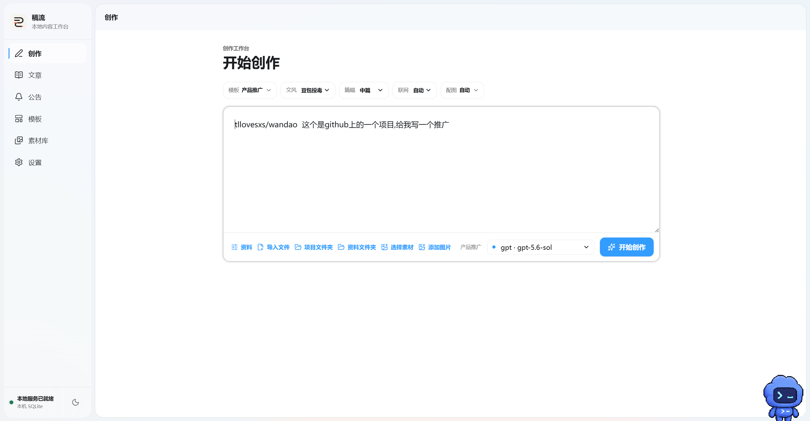
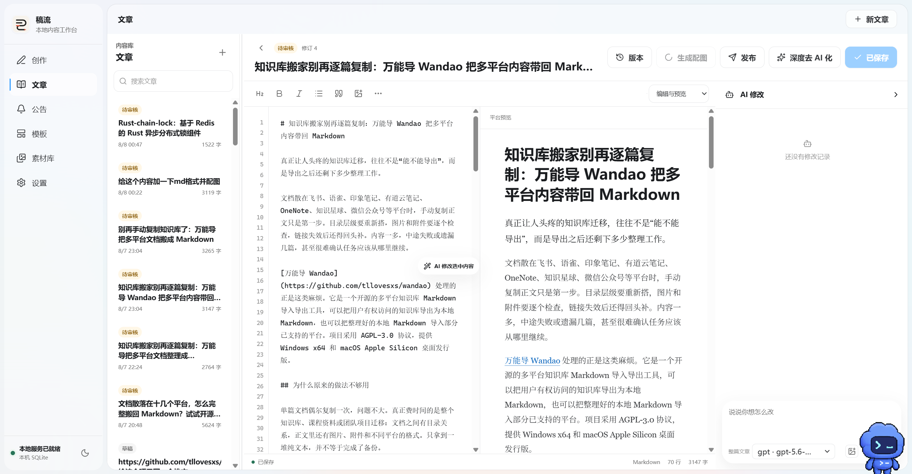
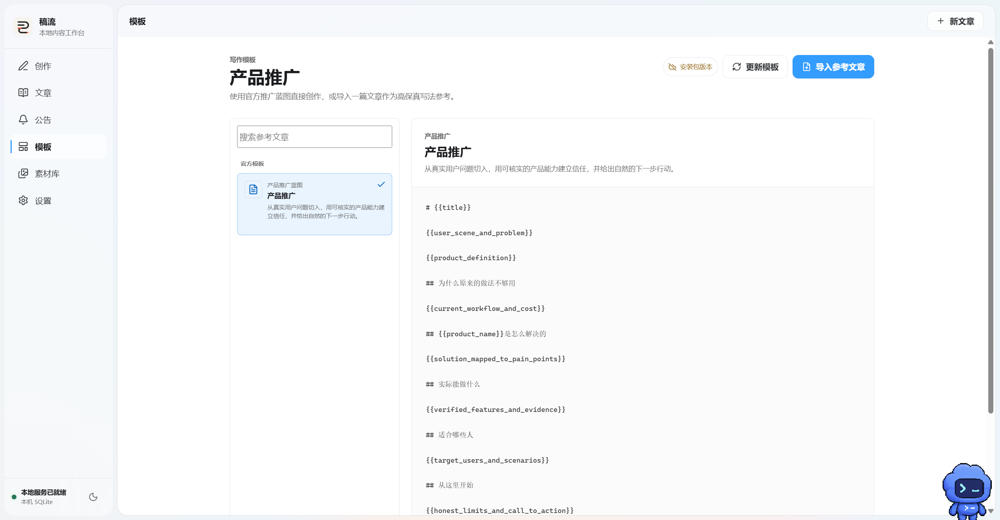
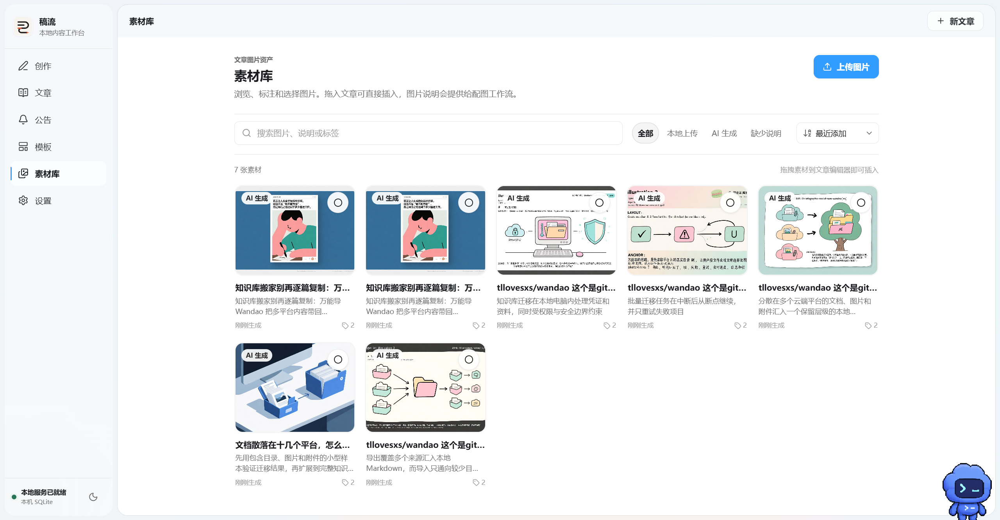
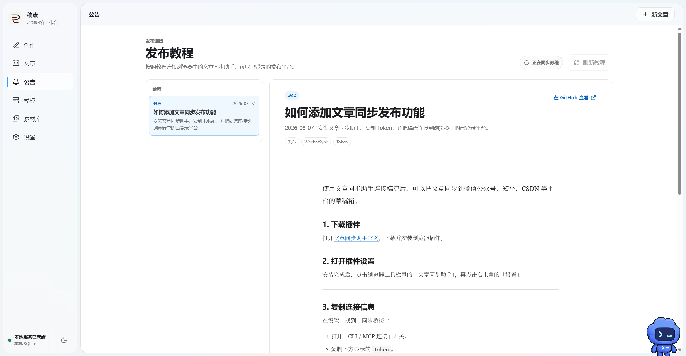
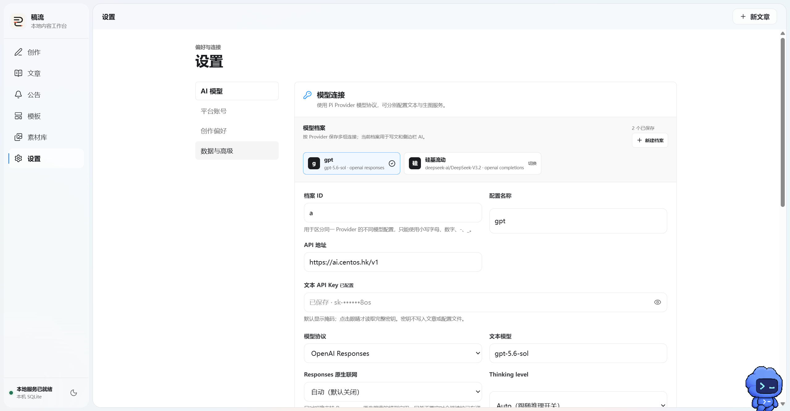

<p align="center">
  
</p>

<h1 align="center">稿流 Gaoliu</h1>

<p align="center">
  <strong>让内容从想法，自然流向发布。</strong>
</p>

<p align="center">
  在一个本地桌面工作台中完成资料读取、联网研究、AI 写作、正文配图、文章修改与多平台草稿同步。<br>
  保留 Markdown 主稿和每次修改记录，让 Agent 真正参与创作，而不是只生成一段无法继续维护的文字。
</p>

<p align="center">
  <a href="https://github.com/tllovesxs/open-publisher/releases"></a>
  <a href="https://github.com/tllovesxs/open-publisher/releases"></a>
  <a href="https://github.com/tllovesxs/open-publisher/stargazers"></a>
  <a href="https://github.com/tllovesxs/open-publisher/network/members"></a>
  <a href="https://github.com/tllovesxs/open-publisher/issues?q=is%3Aissue"></a>
  <a href="LICENSE"></a>
  
</p>

<p align="center">
  
  &nbsp;
  
  &nbsp;
  
  &nbsp;
  
</p>

<p align="center">
  <strong><a href="https://github.com/tllovesxs/open-publisher/releases">📦 下载最新版</a></strong>
  &nbsp;·&nbsp;
  <a href="docs/integrations/wechatsync-publishing-guide.md">📖 发布教程</a>
  &nbsp;·&nbsp;
  <a href="https://github.com/tllovesxs/open-publisher/issues">🐛 反馈问题</a>
  &nbsp;·&nbsp;
  <a href="CONTRIBUTING.md">🤝 参与共创</a>
</p>

稿流是一个面向创作者、独立开发者和内容团队的本地 AI 内容工作台。你可以只输入一个选题，也可以交给它一个本地项目文件夹、GitHub 仓库、参考资料或图片，让写作 Agent 先理解事实，再完成文章。

文章生成后仍然是可继续编辑的 Markdown。你可以在同一个页面中修改正文、与 AI 讨论、局部重写、补充图片、查看预览，并随时恢复到任意一次保存过的版本。需要分发时，稿流会读取 WechatSync 当前已经登录且可用的平台，把确认后的内容同步为平台草稿，实现全平台的发布效果.

稿流不绑定某一家模型服务。文本模型和生图模型可以分别配置，也可以保存多套文本模型并在创作页或文章侧边栏中切换。

如果这个项目对你有帮助，欢迎在 GitHub 点一个 Star ⭐，这对项目后续迭代很重要。

---

## 🖼️ 界面预览

<table>
  <tr>
    <td width="50%" align="center">
      
      <br>
      <sub><strong>开始创作</strong>：组合项目、资料、素材、模型与写作策略</sub>
    </td>
    <td width="50%" align="center">
      
      <br>
      <sub><strong>文章工作台</strong>：Markdown 编辑、同步预览、版本记录与 AI 改稿</sub>
    </td>
  </tr>
  <tr>
    <td width="50%" align="center">
      
      <br>
      <sub><strong>写作模板</strong>：使用产品推广蓝图或导入参考文章仿写</sub>
    </td>
    <td width="50%" align="center">
      
      <br>
      <sub><strong>素材库</strong>：统一管理本地图片、AI 生成素材和文章配图</sub>
    </td>
  </tr>
  <tr>
    <td width="50%" align="center">
      
      <br>
      <sub><strong>发布教程</strong>：连接 WechatSync，将文章同步到已登录平台</sub>
    </td>
    <td width="50%" align="center">
      
      <br>
      <sub><strong>模型设置</strong>：保存多套 Provider 档案，分别配置文本与生图模型</sub>
    </td>
  </tr>
</table>

## ✨ 为什么使用稿流

| | 能力 | | 能力 |
| --- | --- | --- | --- |
| 📚 | **基于资料写作**：读取本地项目、GitHub 仓库和用户资料，减少脱离事实的空写 | 🌐 | **按需联网核实**：通过模型原生搜索或 Tavily 查询最新信息 |
| ✍️ | **写作与改稿一体**：生成全文后继续对话、局部修改、全文重写和选区优化 | 🖼️ | **视觉 Agent 配图**：分析文章结构，优先匹配素材库，不足时再调用生图模型 |
| 📝 | **Markdown 主稿**：编辑与预览同步，支持表格、任务列表、代码块、引用和 Mermaid | 🔄 | **版本记录**：每次保存与 AI 修改形成修订，可预览并恢复历史版本 |
| 🎨 | **模板与仿写**：内置产品推广模板，也可从参考文章提取结构、文风和排版 | 🤖 | **多模型配置**：文本模型与生图模型独立配置，多套文本模型随时切换 |
| 📦 | **本地素材库**：粘贴、导入和管理图片，支持作为参考、素材或正文插图 | 📤 | **多平台草稿**：展示 WechatSync 当前已登录的平台，确认后同步平台草稿 |
| 🔐 | **本地优先**：文章、修订、素材和任务数据保存在本机，外部写入必须明确确认 | ⚡ | **桌面体验**：Tauri 原生桌面端，支持任务进度、停止生成和失败恢复 |

## 🚀 从一个想法到多平台草稿

### 先把事实交给 Agent

稿流支持多种创作入口，不要求用户先整理成一份完美的提示词：

- **主题创作**：输入主题、目标读者和希望文章解决的问题
- **本地项目**：选择项目文件夹，让 Agent 阅读可用的说明、配置和源码资料
- **GitHub 项目**：粘贴仓库地址，自动读取公开简介、README 和语言信息
- **联网研究**：遇到最新事实或陌生产品时，先检索来源再开始写作
- **图片输入**：粘贴图片作为内容参考、素材库资源或待插入的正文图片
- **参考模板**：使用产品推广模板，或根据已有文章提取结构和表达方式

对于具名项目，项目资料是事实来源；参考文章只提供表达方式。资料没有出现的功能、数据、案例和技术细节，不应由 Agent 根据项目名称猜测。

### 在文章里继续完成创作

生成正文不是流程终点。文章页同时提供 Markdown 编辑、渲染预览和 AI 侧边栏：

- 直接编辑 Markdown，并按比例同步编辑区和预览区
- 让 AI 回答文章相关问题，或执行全文、局部和选区修改
- 粘贴图片，让 AI 识别图片、加入素材库或插入合适段落
- 根据正文变化评估已有配图匹配度，并决定是否重新配图
- 查看每一次修订的内容、修改原因和时间，恢复时保留原历史记录
- 在生成过程中查看读项目、联网、写作、配图和保存等真实进度

### 让配图跟着文章结构走

视觉 Agent 不会只在文末堆放图片。它会先分析当前正文和小节，再给出插入位置、图片用途与来源策略：

1. 优先检查用户已经选择的素材
2. 判断哪些段落真正需要图片
3. 为缺少素材的位置生成独立生图提示词
4. 由用户确认或调整配图方案
5. 将生成结果加入本地素材库，并写入新的文章修订

用户可以选择自动配图、指定数量或不配图。文章修改后，也可以重新生成与当前正文一致的配图策略。

### 确认后再同步平台

稿流通过本机 WechatSync 桥读取当前浏览器中已经登录、且适配器支持的平台。平台列表不是写死的；软件只展示当前环境真实可用的账号。

同步前，用户可以检查文章和目标平台。稿流负责保存平台草稿，不读取浏览器 Cookie，也不会代替用户点击最终发布按钮。连接和 Token 配置请查看 [WechatSync 发布教程](docs/integrations/wechatsync-publishing-guide.md)。

## ⚡ 快速开始

### 安装桌面版

1. 打开 [GitHub Releases](https://github.com/tllovesxs/open-publisher/releases)
2. 下载 Windows x64 安装包或 macOS Apple Silicon 安装包
3. 启动稿流，在“设置”中配置文本模型
4. 如需 AI 生图，再单独配置生图模型
5. 回到“创作”，输入主题并按需添加项目、模板、素材或图片
6. 生成并检查文章，确认后同步到当前已登录的平台草稿

发行版已内置稿流 Agent Runtime，普通用户不需要安装 Node.js、Bun、Rust 或 Python。

> ⚠️ **签名说明：** 当前自动构建产物尚未完成 Windows 代码签名、macOS Developer ID 签名和 Apple 公证。请只从本项目 GitHub Releases 下载，并根据系统提示确认应用来源。

### 配置模型

文本模型与生图模型使用两套独立配置：

| 配置 | 用途 | 是否必需 |
| --- | --- | --- |
| **文本模型** | 写作、改稿、项目理解、研究与视觉规划 | 是 |
| **生图模型** | 在素材不足时生成封面或正文图片 | 否 |
| **Tavily** | 文本模型没有原生联网搜索时提供检索 | 否 |
| **GitHub Token** | 提高 GitHub API 访问额度；公开仓库可不填 | 否 |
| **WechatSync Token** | 连接本机发布桥并读取可用平台 | 发布时需要 |

稿流支持 OpenAI-compatible 模型服务，并会在设置页测试连接、发现可用模型。API 地址、模型名称和密钥请以所选服务商提供的信息为准。

<details>
<summary><strong>🧑‍💻 源码启动与本地开发</strong></summary>

源码开发需要：

| 环境 | 版本 |
| --- | --- |
| Node.js | `22.19+` |
| pnpm | `11.7.0` |
| Bun | `1.3.14` |
| Rust | `1.88.0` |

在仓库根目录执行：

```powershell
git clone https://github.com/tllovesxs/open-publisher.git
cd open-publisher
pnpm install --frozen-lockfile
pnpm dev
```

`pnpm dev` 会先编译 TypeScript Agent Runtime，再启动 Tauri 桌面端。只开发前端界面时可以运行：

```powershell
pnpm dev:web
```

浏览器预览只用于界面开发，不能调用本地 Agent、读取项目文件或执行发布。

</details>

---

<details>
<summary><strong>🛠️ 质量检查与安装包构建</strong></summary>

运行完整基础检查：

```powershell
pnpm quality
```

检查范围包括 TypeScript 类型与测试、前端构建、Agent Runtime 编译、桌面 Bundle 输入检查，以及 Rust 格式、编译和测试。

GitHub Actions 流水线支持：

| 平台 | 架构 | 产物 |
| --- | --- | --- |
| Windows | x64 | NSIS `.exe` 安装包 |
| macOS | Apple Silicon | `.dmg` 安装包 |

推送 `v*` Tag 后，流水线会生成安装包、SHA-256 校验文件和 GitHub Release 草稿。详细边界见 [发布与打包说明](docs/development/release-packaging.md)。

</details>

---

## 🏗️ 技术架构

| 分层 | 主要技术 | 负责内容 |
| --- | --- | --- |
| **桌面界面** | React 19、TypeScript、Vite | 创作、Markdown 编辑、预览、素材与任务状态 |
| **桌面主机** | Tauri v2、Rust | 本地能力边界、敏感配置、进程监管和桌面打包 |
| **Agent Runtime** | TypeScript、Bun、Hono、Pi Agent Core | 模型循环、工具调用、会话压缩、写作与视觉任务 |
| **内容存储** | SQLite、Markdown ArticleStore | 文章、修订、素材、任务、发布计划与回执 |
| **发布连接** | WechatSync 本机桥 | 读取当前登录平台并保存确认后的平台草稿 |

更完整的设计说明见 [系统架构](docs/architecture/system-overview.md)、[Agent 与 Harness](docs/architecture/harness-and-agents.md) 和 [项目基线规范](docs/product/project-baseline.md)。

## 🔐 本地数据与使用边界

- 文章、Markdown 修订、素材和任务记录保存在用户本机
- 文本模型和生图模型分别配置，密钥由桌面端本地安全边界管理
- React WebView 不直接接收平台 Cookie、浏览器凭据或发布桥 Token
- Agent 可以准备和修改内容，但不能绕过确认直接执行最终发布
- 发布任务绑定明确的文章版本和目标平台，内容变化后需要重新确认
- WechatSync 只返回平台标识、登录状态和账号显示名，不把 Cookie 交给稿流
- 不确定的发布结果不会自动重复提交，需要用户核验后处理

请只发布你有权使用的文字与图片，不要在 Issue、截图或日志中公开 API Key、Token、Cookie、账号密码和未发布内容。安全问题请按照 [安全策略](SECURITY.md) 反馈。

## 🤝 参与共创

欢迎参与写作质量、视觉 Agent、Markdown 编辑体验、模型兼容、平台草稿同步、安装包构建和文档维护。

| 入口 | 用途 |
| --- | --- |
| [贡献指南](CONTRIBUTING.md) | 本地开发、提交代码和测试要求 |
| [GitHub Issues](https://github.com/tllovesxs/open-publisher/issues) | 反馈 Bug、提出功能建议 |
| [项目基线规范](docs/product/project-baseline.md) | 了解产品边界、Agent 设计和实施原则 |
| [第三方来源](THIRD_PARTY_NOTICES.md) | 查看依赖、Skill 和提示词资源的来源与许可证 |

## 🔗 项目与联系

| 项目 | 地址 |
| --- | --- |
| GitHub | [tllovesxs/open-publisher](https://github.com/tllovesxs/open-publisher) |
| Issues | [问题与建议](https://github.com/tllovesxs/open-publisher/issues) |
| Releases | [桌面安装包](https://github.com/tllovesxs/open-publisher/releases) |
| 作者 | [tllovesxs](https://github.com/tllovesxs) |
| 联系邮箱 | `tl200599@163.com` |
| 作者微信 | `pressure_spring` |

## 📈 Star history

<a href="https://www.star-history.com/#tllovesxs/open-publisher&Date">
  <picture>
    <source media="(prefers-color-scheme: dark)" srcset="https://api.star-history.com/svg?repos=tllovesxs/open-publisher&type=Date&theme=dark">
    <source media="(prefers-color-scheme: light)" srcset="https://api.star-history.com/svg?repos=tllovesxs/open-publisher&type=Date">
    
  </picture>
</a>

## 📄 License

本项目采用 [GNU Affero General Public License v3.0](LICENSE) 开源。

内置正文配图规则改编自 MIT 协议的 `JimLiu/baoyu-skills` 中 `baoyu-article-illustrator` 工作流。Pi Agent、相关依赖与第三方资源的版本、来源和许可证记录在 [THIRD_PARTY_NOTICES.md](THIRD_PARTY_NOTICES.md)。

<p align="center">
  <strong>稿流：让内容从想法，自然流向发布。</strong><br>
  如果这个项目对你有帮助，欢迎在 GitHub 点一个 Star ⭐
</p>
