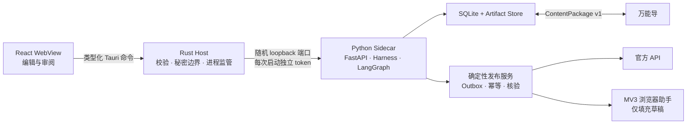

# Open Publisher

> 一个本地优先、以 Markdown 为内容源的 AI 写作与多平台发布工作台。

Open Publisher 把研究、写作、审核、配图规划、平台改写和发布任务放进同一个桌面工作区。
它不是“让 Agent 拿着账号自动乱点”的脚本：Agent 只生产结构化内容，真正的发布动作由
可审计、可重试的确定性任务队列执行。

当前版本为 `0.1.0-alpha`。P0 主要用于验证产品架构和本地演示闭环；默认使用
deterministic mock（确定性模拟）提供商，不会向真实模型或内容平台写入数据。

## v0.1 做到了什么

| 能力 | 当前状态 |
| --- | --- |
| 桌面工作区 | React + Tauri v2，包含 Markdown 编辑、预览、修订、工作流、素材、连接、技能、任务与发布界面 |
| 内容模型 | Markdown 主稿、不可变 `ArticleRevision`、内容寻址 Artifact 和平台派生稿 |
| 多 Agent | Python Harness + LangGraph；研究、提纲、写作、自然化、审核、风险、视觉规划和平台改写均以结构化 Artifact 交接 |
| 模型接入 | 默认 Mock；提供 OpenAI-compatible 文本/图像提供商的接入边界，不内置独立模型网关 |
| 发布可靠性 | SQLite durable outbox、幂等键、审批哈希、Attempt/Receipt 和 `UNKNOWN` 状态核验基础 |
| 平台接入 | 微信公众号官方 API 的能力与草稿载荷基础；CSDN、今日头条和微信公众号的 MV3 浏览器草稿填充基础 |
| 工作流定制 | 版本化声明式工作流、必需节点与 DAG 校验；不执行用户提供的任意 Python/JavaScript |
| 万能导互通 | 通过 `ContentPackage v1` 交换 Markdown、素材、哈希和来源信息，不共享数据库或凭据 |

P0 **没有承诺**以下能力：

- 没有声称微信公众号、CSDN 或今日头条的真实账号发布已经验证；
- 不会在默认演示或测试中执行真实平台写入，浏览器扩展也不会代替用户点击最终发布；
- 没有产出或签名 Windows、macOS、Linux 安装包；
- 没有验证长时间生图、供应商限流、断网恢复和平台编辑器 DOM 变更；
- 没有“桌面关闭后仍能运行”的云端定时任务，也不要求用户部署网络服务；
- 不把“去 AI 化”描述为规避检测，只提供自然表达、重复检查和人工编辑辅助。

平台的准确能力边界见
[`docs/integrations/platform-capabilities.md`](docs/integrations/platform-capabilities.md)，
验收范围见 [`docs/product/v0.1-acceptance.md`](docs/product/v0.1-acceptance.md)。

## 架构



| 分层 | 主要技术 | 责任 |
| --- | --- | --- |
| 桌面界面 | React 19、TypeScript、Vite | Markdown 编辑、预览、审阅与任务状态展示 |
| 本地主机 | Tauri v2、Rust | IPC 校验、Sidecar 生命周期和敏感能力边界 |
| Agent Runtime | Python 3.12/3.13、FastAPI、LangGraph | Harness、模型访问、工作流、Artifact 与发布用例 |
| 本地持久化 | SQLite、SQLAlchemy、Alembic | 修订、运行快照、任务、尝试与回执 |
| 跨进程协议 | JSON Schema、TypeScript SDK | 桌面、Sidecar、扩展、技能和适配器的版本化契约 |
| 浏览器助手 | Manifest V3 | 在明确来源的编辑器中填充草稿，异常时返回 `NEEDS_USER` |

更完整的说明在
[`system-overview.md`](docs/architecture/system-overview.md) 和
[`harness-and-agents.md`](docs/architecture/harness-and-agents.md)。

## 快速开始

当前开发路径以 Windows PowerShell 为准。请先准备：

- Node.js 22+
- pnpm 11（仓库声明版本为 `11.7.0`）
- Rust 1.88（由 `rust-toolchain.toml` 固定）
- Python 3.12 或 3.13

在仓库根目录安装依赖：

```powershell
.\scripts\bootstrap.ps1
```

脚本会安装 pnpm workspace 依赖，创建 `.venv`，并以开发模式安装 Python Runtime
及 LangGraph。首次安装依赖需要联网。

启动完整桌面开发环境：

```powershell
pnpm dev
```

Tauri 的 Rust Host 会启动 Python Sidecar，为它选择随机本机端口并注入每次启动独立的
Bearer token。端口和 token 不会返回给 WebView。

只开发界面时可以运行：

```powershell
pnpm dev:web
```

该模式使用 interface-only bridge，只展示本地界面与模拟数据，不能直接访问 Python
Sidecar，也不能执行发布。

运行当前全部基础检查：

```powershell
.\.venv\Scripts\python.exe .\scripts\quality_check.py
```

它会依次执行 TypeScript 检查与测试、Web 构建、Python Ruff/Pytest，以及 Rust
格式、编译检查和测试。真实模型及真实平台调用不属于默认测试。

详细演示步骤见
[`docs/development/manual-demo.md`](docs/development/manual-demo.md)。

## 安全设计

- WebView 不直接访问 Sidecar；完整桌面模式只通过白名单 Tauri 命令调用 Rust Host。
- Sidecar 仅监听随机 loopback 端口，`/api/v1` 请求需要每次启动生成的 Bearer token。
- 连接资料、工作流与普通数据库记录不应携带 API Key、Cookie 或平台密码。
- Agent 和第三方 Skill 只能生成结构化 Artifact，不能直接获得发布权限。
- 发布审批绑定内容和计划哈希；重复入队复用幂等任务，不确定结果先进入 `UNKNOWN`
  并核验，不能盲目重试。
- 浏览器任务只携带文章、目标来源、过期时间和一次性 nonce；扩展不读取或导出 Cookie，
  不点击最终发布按钮。
- `pnpm dev:web` 明确不具备 Sidecar 与秘密访问能力。

这是 P0 安全基线，不等于经过生产安全审计。真实凭据、账号和未发布稿件不要放进公开
Issue 或测试夹具。详见 [`SECURITY.md`](SECURITY.md) 与
[`trust-boundaries.md`](docs/architecture/trust-boundaries.md)。

## 与万能导交换内容

Open Publisher 和万能导保持两个独立应用，不共享数据库、Python 环境、插件进程或
平台凭据。`ContentPackage v1` 使用普通目录作为交换边界：

```text
content-package/
  manifest.json
  articles/
    <stable-article-id>.md
  assets/
    <sha256>.<extension>
```

万能导可以先把 `articles` 目录当作普通 Markdown 来源导入；后续 Provider 可读取
`manifest.json` 获得稳定 ID、哈希、来源和修订元数据。导入端必须拒绝绝对路径、
父目录穿越、越界符号链接和哈希不匹配。完整约定见
[`docs/integrations/wandao.md`](docs/integrations/wandao.md)。

## 仓库结构

```text
apps/desktop/                   React + Tauri v2 桌面端
services/agent-runtime/         FastAPI + LangGraph 本地 Sidecar
extensions/browser-publisher/  Manifest V3 草稿填充扩展
packages/contracts/             版本化 JSON Schema 与类型
packages/platform-sdk/          平台适配器契约
packages/skill-sdk/             Skill 包契约与校验
skills/official/                第一方声明式 Skills
docs/adr/                       架构决策记录
docs/architecture/              系统、信任边界与 Agent 设计
docs/integrations/              平台与万能导集成边界
scripts/                        安装与质量检查脚本
```

跨桌面、Python、浏览器扩展或 Skill 的改动应先更新 `packages/contracts` 中的版本化
契约。贡献流程见 [`CONTRIBUTING.md`](CONTRIBUTING.md)。

## 许可与第三方来源

仓库核心代码采用 [`AGPL-3.0-only`](LICENSE)。

AIWriteX 和 Guizang Social Card Skill 只用于产品/架构研究或可选集成评估；v0.1
没有复制或内置它们的源码与素材。来源、核对版本和许可证记录在
[`THIRD_PARTY_NOTICES.md`](THIRD_PARTY_NOTICES.md)。引入新的模板、提示词、Skill
或适配器前，需要记录来源 URL、精确版本、SPDX 标识、归属信息和兼容性结论。
