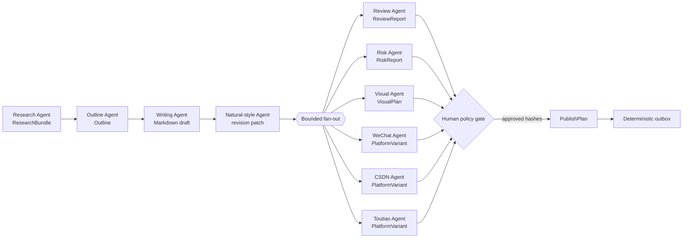

# Harness and multi-agent orchestration

Open Publisher uses a **Harness** as the control plane around LangGraph. LangGraph executes a
versioned content graph; the Harness decides whether a run may start, which tools it may use, how
much it may spend, where artifacts are stored, and when a human gate is required.

An agent never owns platform credentials and never calls a publish adapter. It receives typed
inputs and returns a typed artifact.

## Default article workflow

Research, outline, writing, and natural-style passes are sequential because each changes the
canonical content. Review, risk, visual planning, and platform variants are independent readers
of the same immutable revision, so the Harness may run them concurrently.

The default `maxParallel` is four. Additional platform variants wait in the local queue; spawning
more agents does not bypass the model-provider concurrency limit.

## Agent catalog

| Agent | Required inputs | Output | Typical tools |
| --- | --- | --- | --- |
| Research | topic, source policy | `ResearchBundle` | source fetcher, deduplicator, evidence scorer |
| Outline | research bundle, audience | `Outline` | structure templates, length budget |
| Writing | outline, evidence | Markdown draft | text model, citation linker |
| Natural style | draft, user style policy | `ArticlePatch` | repetition detector, sentence-rhythm analysis |
| Review | canonical revision | `ReviewReport` | coherence, evidence coverage, factual-claim checklist |
| Risk | canonical revision, platform policy | `RiskReport` | sensitive terms, prohibited claims, PII and link checks |
| Visual | canonical revision, asset policy | `VisualPlan` | cover/illustration prompt planner, image provider |
| Platform | canonical revision, one target | `PlatformVariant` | length, title, tags, layout and asset constraints |

“Natural style” means clarity and authorial editing support. It does not promise to evade AI
detection or platform review.

## Node customization

The visual workflow editor changes a declarative `WorkflowDefinition`; it does not execute
arbitrary Python or JavaScript.

- Draft-only workflows may skip optional natural-style, visual, or human-review nodes.
- Publishing workflows always require risk evaluation, an approval bound to content hashes, and
  the deterministic publish service.
- Removing a required node, creating a cycle, leaving an unreachable node, or exceeding the
  concurrency limit fails validation before a snapshot is created.
- A skip is recorded as a run event so the result does not appear equivalent to a full review.

## Run budget

Each snapshot defines maximum model calls, wall-clock duration, and parallelism. Provider-specific
token or monetary limits can be added without changing the graph contract. The Harness reserves a
model call before I/O and persists the claim so a restart cannot silently exceed the budget.

## Failure and recovery

- Node output is written to the content-addressed artifact store before downstream execution.
- A retry receives the same immutable inputs and idempotency scope.
- A paused approval can resume only the matching snapshot.
- A workflow failure cannot enqueue a publish job.
- An ambiguous platform result becomes `UNKNOWN` and enters reconciliation; an agent is not asked
  to guess whether publication succeeded.

