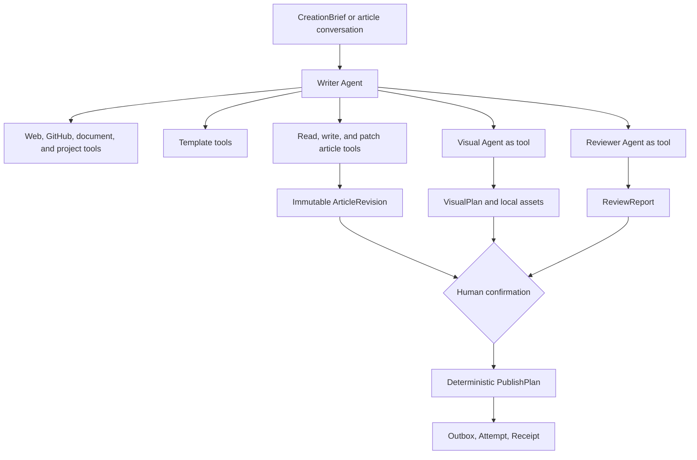

# Pi Agent harness and collaboration

Open Publisher wraps Pi Agent Core with a product Harness. Pi owns the model/tool loop, streaming,
cancellation, steering, sessions, and compaction. The Harness owns permissions, budgets, durable
events, checkpoints, revisions, artifacts, human gates, and deterministic publishing.

An Agent never owns platform credentials and never calls a publish adapter. It receives typed
inputs and can only invoke explicitly registered, schema-validated tools.

## Default article workflow

Writer is the only long-lived conversational Agent for an article. Research, GitHub, local project
reading, template lookup, asset search, and article persistence are tools rather than independent
chatting Agents. Visual and Reviewer are bounded specialists returning strict structured results.

## Agent catalog

| Agent | Lifetime | Responsibility | Direct canonical write |
| --- | --- | --- | --- |
| Writer | one persistent session per article | create, discuss, rewrite, patch, research, and delegate | only through version-checked article tools |
| Visual | one task | insertion anchors, asset matching, prompts, and image plan | no; returns a `VisualPlan` |
| Reviewer | one task | fact coverage, structure, repetition, risk, and platform constraints | no; returns a `ReviewReport` |
| Template Profiler | stateless task | preserve source and extract structure, voice, layout, variables, and fixed blocks | no; saves a template candidate |
| Topic Agent | separate feature task | cluster, enrich, score, and explain topic candidates | no |

## Scoped tools

The Writer may receive only the tools required by its current operation. Read tools may run with a
bounded concurrency of three. Article mutations are serialized per article and checked against the
base revision hash. Image generation uses a separate queue with a default concurrency of two.

Pi's default Bash, unrestricted `read`, `write`, and `edit` tools are not registered. Open Publisher
provides domain tools such as `read_project`, `search_web`, `write_article`, `edit_article`,
`query_assets`, and `invoke_visual_agent`.

## Run budget and state

Each run snapshot fixes its Prompt, model profile, tools, policy, base revision, and budgets before
execution. A run uses monotonic durable events and ends in `completed`, `failed`, `stopped`, or
`interrupted`; the UI must never infer completion from a closed stream alone.

Provider streams cannot resume from an arbitrary token after process death. Recovery restarts from
the latest durable boundary: a Markdown working checkpoint, complete tool result, session summary,
or committed revision.

## Human and publishing boundary

The Writer may create a publish-plan candidate. Only an explicit UI command can approve and enqueue
it. Every external write still requires a frozen revision hash, idempotency key, Outbox job, Attempt,
and Receipt. Ambiguous results enter reconciliation instead of being guessed by an Agent.
