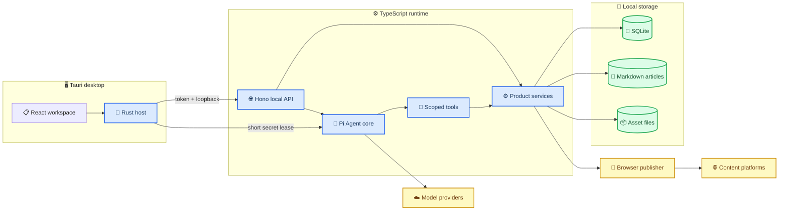
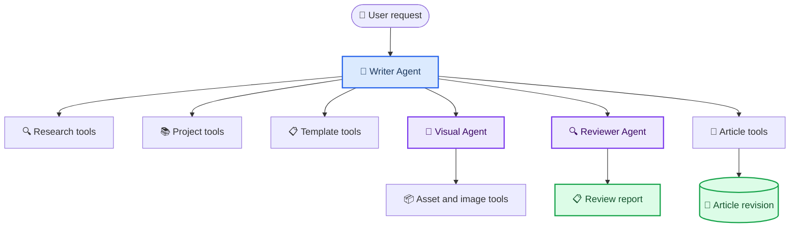
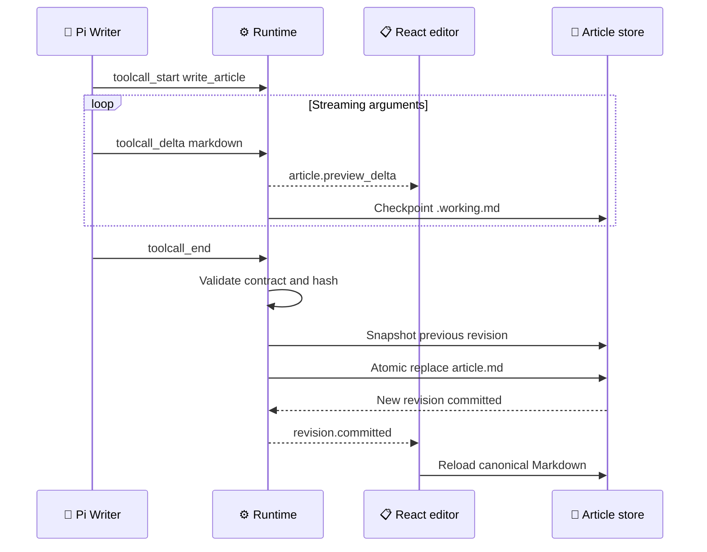
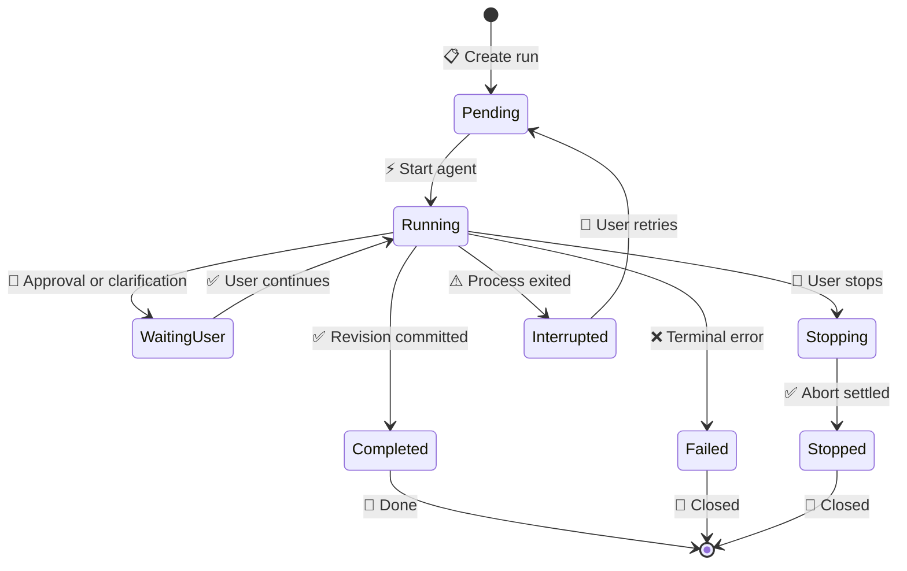

# 稿流 Pi Agent Runtime 重构执行文档

_基于当前 `open-publisher` 仓库制定的完整迁移方案，目标是在保留产品数据与发布可靠性的前提下，以 Pi Agent 取代 Python、FastAPI 和 LangGraph Runtime。_

---

| 项目 | 内容 |
| --- | --- |
| 文档状态 | Proposed / 待执行 |
| 目标基线 | `0.3` |
| 制定日期 | 2026-08-04 |
| 目标平台 | Tauri v2 桌面端，优先 Windows |
| 最终 Runtime | TypeScript + Bun + Pi Agent Core |
| 最终要求 | 发行包和主运行路径中不包含 Python |
| 迁移原则 | 保留数据与确定性服务，替换 Agent 与业务 Runtime |

> 📌 **执行结论：** 不重置仓库，不重写 React、Rust Host、浏览器扩展和发布协议。新增 TypeScript Runtime，逐项接管 Python 能力，完成数据兼容与真实 E2E 后再删除 Python。

## 📋 目标、范围与不变量

### 重构目标

本次重构完成后，稿流应具备以下特征：

- 使用 `@earendil-works/pi-agent-core` 执行模型循环、工具调用、流式事件、取消、用户插话、会话和上下文压缩[^pi-core]
- 使用 `@earendil-works/pi-ai` 统一文本模型与供应商协议
- 使用独立 TypeScript Sidecar 承担现有 FastAPI Runtime 的本地 API、数据、Agent、模型和发布业务
- 使用 Markdown 文件作为文章内容正本，SQLite 保存索引、会话、修订、任务、配置和发布状态
- 使用 Rust 继续承担操作系统权限、秘密存储、Sidecar 监督、随机端口和每次启动令牌
- 使用现有浏览器扩展继续承担浏览器登录态内的平台草稿交付
- 为未来 Web 端保留 `ArticleStore`、`SecretProvider`、`PlatformBridge` 等可替换接口

### 明确保留

| 当前模块 | 处理方式 | 原因 |
| --- | --- | --- |
| `apps/desktop` React UI | 保留并拆分状态层 | 已有五页产品结构与编辑器交互 |
| `apps/desktop/src-tauri` | 保留并改造启动目标 | Rust 信任边界与监督逻辑正确 |
| `packages/contracts` | 保留并升级到协议 v2 | 已有 JSON Schema 与跨进程契约测试 |
| SQLite 用户数据 | 原位兼容迁移 | 不能丢失文章、模板、素材、配置和发布记录 |
| Artifact 与素材文件 | 保留原路径并建立新索引 | 避免二次复制大文件 |
| PublishPlan、Outbox、Attempt、Receipt | TypeScript 等价移植 | 发布必须保持确定性、幂等和可核验 |
| `extensions/browser-publisher` | 保留 | 浏览器登录态应继续留在浏览器进程 |
| Baoyu 配图资源 | 保留许可证与修订后迁移 | 已作为独立 MIT 资源纳入当前项目 |

### 明确移除

最终切换完成后删除：

- Python FastAPI、Uvicorn、Pydantic、SQLAlchemy、Alembic 和 LangGraph 依赖
- `services/agent-runtime` 中的 Python API、ORM、Repository、Harness 和 Workflow 实现
- 根目录 `pyproject.toml`、Python 质量脚本和 Python Sidecar 启动逻辑
- Tauri 中的 Python 解释器发现、`PYTHONPATH`、虚拟环境和 `OPEN_PUBLISHER_PYTHON` 逻辑
- 前端中的 `python_sidecar` 命名和面向七节点 LangGraph 的 UI 假设
- 默认批量生成后端及未进入产品主路径的遗留接口

### 继续成立的系统不变量

1. React WebView 不接收持久化明文密钥、平台 Cookie 或发布凭据
2. Rust 是本地操作系统与秘密边界
3. Markdown 修订是内容正本，HTML 和平台载荷是派生物
4. Agent 只能通过受控工具修改文章，不能写任意路径或直接发布
5. 每次正式正文变更都创建不可变修订并记录内容哈希
6. 外部写入必须经过预览、确认、Outbox、幂等、Attempt 和 Receipt
7. 运行事件必须可排序、可停止、可诊断，迟到结果不能覆盖新修订
8. 默认测试不调用真实模型和真实平台，真实测试必须显式启用

> ⚠️ **治理要求：** 当前 `AGENTS.md` 和 ADR 0001 明确指定 Python Runtime。正式编码前必须先新增 ADR 0003，并把项目基线升级到 `0.3`。不能一边违反旧基线，一边继续把旧基线标记为 Accepted。

## ⚙️ 目标系统架构

### 进程与信任边界



Pi 不直接运行在 React WebView 中。最终由 Rust 启动编译后的 TypeScript Sidecar，以避免在 WebView 暴露 API Key、文件权限和平台业务。

### 最终目录结构

```text
open-publisher/
├── apps/
│   └── desktop/
│       ├── src/                       # React UI
│       └── src-tauri/                 # Rust Host 与 Sidecar 监督
├── services/
│   └── agent-runtime/                 # 最终 TypeScript Runtime
│       ├── package.json
│       ├── tsconfig.json
│       ├── src/
│       │   ├── main.ts
│       │   ├── api/                   # Hono 路由、鉴权、SSE
│       │   ├── agent/                 # Pi 适配器、Agent 工厂、会话
│       │   ├── prompts/               # 版本化系统提示词
│       │   ├── tools/                 # 受限工具
│       │   ├── services/              # 文章、模板、素材、发布业务
│       │   ├── storage/               # SQLite、迁移、ArticleStore
│       │   ├── providers/             # 模型、搜索、生图
│       │   ├── publishing/            # Plan、Outbox、Adapter
│       │   └── resources/             # Baoyu 等许可资源
│       └── tests/
├── extensions/
│   └── browser-publisher/
├── packages/
│   ├── contracts/
│   ├── platform-sdk/
│   └── skill-sdk/
└── docs/
```

迁移期间允许暂时使用 `services/agent-runtime-ts`。最终删除 Python 目录后，将其改名为 `services/agent-runtime`，避免长期保留 `legacy`、`next` 等命名。

### 技术基线

| 能力 | 最终选择 | 约束 |
| --- | --- | --- |
| TypeScript 版本 | 仓库现有 `5.9.x` | 开启 `strict` |
| 包管理 | 现有 `pnpm` workspace | 不引入第二套 lockfile |
| Runtime | Bun 编译独立可执行文件 | 开发与发行使用同一入口[^bun-compile] |
| Agent | `@earendil-works/pi-agent-core` | 固定精确版本或 commit |
| 模型 | `@earendil-works/pi-ai` | 统一流式事件和供应商适配 |
| 本地 API | Hono | 仅监听随机 loopback 端口[^hono] |
| 工具参数 | TypeBox | 与 Pi 工具定义保持一致 |
| 边界校验 | AJV + `packages/contracts` | HTTP、IPC、扩展消息必须校验 |
| 数据库 | SQLite + Drizzle + Bun SQLite | Runtime 是内容业务库唯一写者 |
| 日志 | 结构化 JSON 日志 | 自动脱敏，按 run ID 查询 |
| 测试 | Vitest | 真实模型单独标记 |
| 打包 | Tauri external binary | Rust 负责启动、回收和健康检查[^tauri-sidecar] |

### Sidecar 启动协议

Rust 启动 `open-publisher-agent-runtime` 时只传递：

```text
OPEN_PUBLISHER_RUNTIME_PORT=<random-loopback-port>
OPEN_PUBLISHER_RUNTIME_TOKEN=<per-launch-random-token>
OPEN_PUBLISHER_DATA_DIR=<absolute-data-dir>
OPEN_PUBLISHER_ARTICLE_DIR=<absolute-article-dir>
OPEN_PUBLISHER_PROTOCOL_VERSION=2
```

模型密钥不通过普通环境变量长期传入。Runtime 调用模型前向 Rust 请求限定 Provider、用途和过期时间的秘密租约，并通过 Pi 的动态 `getApiKey` 能力解析。

Sidecar 必须提供：

- `GET /health/live`：进程可用
- `GET /health/ready`：数据库、迁移和资源加载完成
- `GET /v2/version`：协议、Runtime、Pi 版本和构建信息
- 每 5 秒更新 Rust 看门狗心跳
- 收到父进程退出或 token 失效后主动结束

## 🔧 Pi 复用与自研边界

### 直接复用

| Pi 能力 | 使用方式 |
| --- | --- |
| `Agent` 与 Agent loop | 直接使用，不再自研模型工具循环 |
| `pi-ai` Provider 流 | 直接使用其统一流式消息 |
| `message_update` | 转换为稿流文章、聊天和工具预览事件 |
| 工具参数校验 | 使用 Pi 的工具定义与验证入口 |
| 并行/串行工具执行 | 搜索可并行，文章写入和发布准备必须串行 |
| `beforeToolCall` | 工具授权、文章版本、路径和审批检查 |
| `afterToolCall` | 记录 Artifact、成本、日志和终止提示 |
| `AbortSignal` | 贯穿模型、搜索、子 Agent 和生图任务 |
| `steer` / `followUp` | 运行中用户补充要求与后续修改 |
| 会话与分支 | 一篇文章一个主会话，局部修改形成可追溯分支 |
| 上下文压缩 | 使用 Pi 压缩机制并替换为稿流摘要模板 |

### 包装后复用

Pi Coding Agent 的 `write` 与 `edit` 适合参考，但不能原样开放。Pi 的面板会流式展示工具参数，完整参数生成并校验后才执行一次文件写入；默认实现使用 `fs.writeFile` 覆盖完整内容[^pi-write]。

稿流需要实现：

```text
write_article       # 完整创建或重写文章
edit_article        # 精确替换一个或多个片段
insert_article_image
restore_revision
```

这些工具复用 Pi 的工具事件和参数流，但替换其文件操作：

1. 校验 `article_id`、当前修订和内容哈希
2. 将流式参数作为前端预览，不立即覆盖正本
3. 把恢复缓存写入 `.working.md`
4. 工具参数完整后创建旧修订快照
5. 写入同目录临时文件并 `rename` 原子替换 `article.md`
6. 创建新的 `ArticleRevision`
7. 发出 `revision.committed` 事件

### 不复用

- 不使用 Pi TUI
- 不开放 Pi 默认 Bash、任意路径 read、write 和 edit
- 不复制 Pi Coding Agent 的系统提示词作为稿流提示词
- 不让 Pi Session 成为发布 Outbox 的唯一存储
- 不让子 Agent 直接共享全部会话或互相无限对话
- 不让模型自主决定最终外部发布

### 依赖管理策略

Pi 以 MIT 许可证发布，可作为 AGPL 项目的依赖，但必须在 `THIRD_PARTY_NOTICES.md` 记录包名、版本、仓库、许可证和版权信息[^pi-license]。

第一阶段按精确 npm 版本安装，不 fork 整个 Pi 仓库。仅在确认公共 API 无法满足以下能力时才维护最小 fork：

- 事件缺少稳定关联 ID
- AbortSignal 无法传播到关键 Provider
- 自定义 SessionStorage 无法接入
- 工具增量参数无法供 React 预览

所有 Pi 调用必须集中在 `src/agent/pi-adapter.ts`，业务代码不得直接散布 Pi 类型。这样可在升级或 fork 时只修改一层。

## 🧠 Agent、提示词与工具设计

### Agent 拓扑

正常写文不再使用“研究、提纲、初稿、润色、审查”七次串行模型调用。



### 角色定义

| 角色 | 是否长期会话 | 职责 | 禁止事项 |
| --- | --- | --- | --- |
| Writer Agent | 是，每篇文章一个 | 写文、全文改写、选区修改、调用研究和视觉能力 | 捏造事实、直接发布、任意文件写入 |
| Visual Agent | 否，按任务运行 | 视觉分析、素材匹配、插图锚点和生图计划 | 自行覆盖正文、决定发布 |
| Reviewer Agent | 否，按需运行 | 事实覆盖、结构、重复、风险和平台约束检查 | 直接应用修改 |
| Template Profiler | 否，独立任务 | 保存原文并提取结构、文风、排版和固定块 | 在普通写文中额外调用 |
| Topic Agent | 否，独立入口 | 热点聚类、证据和候选排序 | 自动启动批量写作 |

Writer 是唯一对用户持续说话的 Agent。Visual 和 Reviewer 通过“Agent as tool”方式调用，返回严格结构化数据，不建立自由聊天网络。

### Writer 操作模式

同一个 Writer Agent 根据入口加载不同操作提示词和工具集合：

```text
create_article      从主题、链接或项目资料创建文章
rewrite_article     按用户方向重写全文
edit_selection      修改一个或多个已选择片段
article_chat        讨论文章并决定是否调用修改工具
resume_article      从中断的 working draft 继续
```

UI 已经明确操作类型时，不额外调用意图分类模型。只有侧边栏自由对话由 Writer 自己判断是回答问题、修改文章还是调用 Visual Agent。

### Writer 工具集

| 工具 | 类型 | 是否并行 | 关键约束 |
| --- | --- | ---: | --- |
| `search_web` | 研究 | 是 | 保存 URL、标题、时间和摘录 |
| `read_github_repo` | 研究 | 是 | 只读公开仓库或用户授权仓库 |
| `read_project` | 本地文件 | 是 | 仅限 Rust 授权目录，忽略敏感文件 |
| `read_document` | 文档 | 是 | PDF、Word、Markdown 转换为受限文本 |
| `get_template` | 模板 | 是 | 返回模板版本和固定块规则 |
| `read_article` | 文章 | 否 | 返回当前修订和哈希 |
| `write_article` | 文章 | 否 | 原子提交完整 Markdown |
| `edit_article` | 文章 | 否 | 精确 Patch，检查基线哈希 |
| `query_assets` | 素材 | 是 | 按描述、标签和比例搜索 |
| `invoke_visual_agent` | 子 Agent | 否 | 返回 `VisualPlan`，不直接写正文 |
| `request_review` | 子 Agent | 否 | 返回 `ReviewReport` |
| `create_publish_plan` | 发布准备 | 否 | 只创建预览计划，不执行发布 |

### 提示词目录与迁移规则

```text
services/agent-runtime/src/prompts/
├── writer/
│   ├── system.v1.md
│   ├── create.v1.md
│   ├── rewrite.v1.md
│   ├── selection-edit.v1.md
│   └── conversation-summary.v1.md
├── visual/
│   ├── system.v1.md
│   └── plan.v1.md
├── reviewer/
│   ├── system.v1.md
│   └── review.v1.md
├── template/
│   ├── profile.v1.md
│   └── imitate.v1.md
└── topic/
    ├── discover.v1.md
    └── evaluate.v1.md
```

迁移时先审计以下现有资源：

- `resources/prompts/article-writer/v1.md`
- `workflows/article_writer_prompt.py`
- `workflows/preset.py`
- `workflows/evidence_ledgers.py`
- `workflows/visual_plan.py`
- `workflows/baoyu_article_illustrator.py`
- `application/template_extraction.py`
- `resources/baoyu-article-illustrator/`

保留其中已经验证有效的产品规则、事实门禁、模板字段、视觉流程和风险规则。删除仅用于 LangGraph 节点之间传话的重复提示词。

每个 Prompt 必须拥有：

```json
{
  "id": "writer.system",
  "version": "1.0.0",
  "sha256": "...",
  "compatibleTools": ["search_web", "read_project", "write_article"],
  "outputContract": "article-write.v1"
}
```

运行快照保存 Prompt ID、版本、哈希、模型、工具版本和策略。第三方 Prompt 不直接复制；Baoyu 原始资源继续保留许可证、修订与包装层。

### 上下文与压缩

Writer 的模型上下文由以下部分组成：

1. 当前系统提示词和操作提示词
2. 最近对话消息
3. 结构化会话摘要
4. 当前文章摘要与修订哈希
5. 用户确认事实和 SourceLedger
6. 当前模板规则
7. 本轮工具结果

接近上下文上限时使用 Pi compaction，但采用稿流摘要格式：目标、读者、已确认事实、来源、模板要求、接受和拒绝的修改、固定术语、未解决问题。摘要禁止保存密钥、Cookie、隐藏思维链和已否定事实。

### 并发规则

- 同一篇文章只允许一个正文写操作
- Writer 工具读取最多并发 `3` 个
- 全局模型调用默认并发 `3` 个，可按 Provider 配置降低
- Visual Agent 规划只运行一个实例
- 图片生成使用独立任务池，默认并发 `2`，允许配置为 `1` 到 `4`
- 发布 Job 串行处理同一平台账号
- 任意取消信号必须传递给子 Agent 和图片任务

## 💾 Markdown、会话与数据设计

### 文章目录

```text
<data-dir>/articles/<article-id>/
├── article.md
├── article.json
├── .working.md
├── revisions/
│   ├── <revision-id>.md
│   └── <revision-id>.json
└── assets/
    ├── cover.webp
    └── illustration-01.webp
```

`article.md` 是当前正式 Markdown。`revisions/` 保存不可变历史，`.working.md` 仅用于中断恢复。`article.json` 保存可移植元数据，但 SQLite 仍是应用索引和业务状态来源。

Markdown 图片只使用相对路径：

```markdown

```

禁止把 Base64、临时 URL、`blob:` URL 和仅本机可解析的绝对路径写入正本。

### 写入与预览时序



`.working.md` 按以下任一条件写入：

- 距上次检查点超过 `1` 秒
- 新增内容超过 `4 KiB`
- 完成一个 Markdown 段落
- 用户请求停止

正式提交使用同目录临时文件和 rename。工具失败或被取消时不得修改 `article.md`，但可以保留 `.working.md` 供用户恢复或放弃。

### 外部编辑与冲突

桌面端监听文章目录变化。外部编辑器修改 `article.md` 时：

1. 计算新内容哈希
2. 如果当前没有 Agent 写操作，导入为新 `ArticleRevision`
3. 如果 Agent 正在生成，保留双方内容并标记 `CONFLICT`
4. UI 展示“使用外部版本 / 使用 AI 版本 / 手动合并”
5. 未解决冲突前禁止发布

### SQLite 所有权

Rust 继续拥有秘密数据库或系统 Keyring；TypeScript Runtime 独占内容业务数据库写权限。React 不直接打开 SQLite，Rust 不直接修改文章业务表。

现有表迁移策略：

| 现有表 | 处理方式 |
| --- | --- |
| `articles` | 保留，增加工作目录和当前修订字段 |
| `article_revisions` | 保留，增加 Markdown 路径和内容哈希兼容字段 |
| `artifacts` | 保留，作为来源、Prompt、报告和图片 Artifact 索引 |
| `workflows` | 历史只读，新的 Agent 不写入 |
| `workflow_runs` | 历史只读，新运行写入 `agent_runs` |
| `runtime_events` | 历史保留，新事件写入 `agent_run_events` |
| `connection_profiles` | 保留并由 TS Repository 接管 |
| `platform_variants` | 保留 |
| `publish_plans` | 保留 |
| `publish_jobs` | 保留 |
| `publish_attempts` | 保留 |
| `publish_receipts` | 保留 |
| `generation_batches` | 标记 Retired，不迁入主 UI |
| `generation_items` | 标记 Retired，不迁入主 UI |

新增表：

```text
agent_sessions
agent_session_entries
agent_runs
agent_run_events
tool_executions
prompt_versions
article_file_states
source_ledger_entries
```

### 数据迁移要求

1. 首次 TS Runtime 启动前复制数据库为带时间戳备份
2. 读取并记录现有 Alembic revision
3. 由 TS migration runner 接管后创建新的 `runtime_schema_versions`
4. 不删除旧表，不重写旧主键
5. 把数据库内 Markdown 导出到文章目录并验证 SHA-256
6. 导出成功后写回路径和哈希
7. 任一文章校验失败则整个迁移回滚
8. 迁移可以重复运行，重复执行不产生重复修订

## 🌐 契约、事件、前端与发布

### 协议升级

新增 `packages/contracts/schemas/v2/`。v1 保留用于旧数据库与迁移测试，不能原地改变语义。

v2 最少包括：

```text
runtime-protocol.schema.json
agent-run.schema.json
agent-event.schema.json
agent-session.schema.json
article-file.schema.json
article-write.schema.json
article-patch.schema.json
visual-plan.schema.json
review-report.schema.json
tool-execution.schema.json
```

所有 Rust、TypeScript 和扩展对象先通过 Schema fixture，再实现业务。

### 统一事件模型

```ts
interface AgentRunEventV2 {
  schemaVersion: "2";
  runId: string;
  sequence: number;
  timestamp: string;
  articleId: string | null;
  agentId: "writer" | "visual" | "reviewer" | "template" | "topic";
  parentAgentId: string | null;
  operation: string;
  type: string;
  payload: unknown;
}
```

事件类型固定为：

```text
run.started
agent.started
agent.message_delta
agent.message_completed
tool.started
tool.progress
tool.completed
tool.failed
article.preview_delta
article.checkpointed
revision.committed
run.waiting_user
run.stopping
run.stopped
run.failed
run.completed
```

`sequence` 在一个 run 内严格递增。重连时客户端传 `afterSequence` 补拉事件，避免 SSE 断开后界面永远卡在“执行中”。

### Run 状态机



模型流无法在进程崩溃后从原 token 位置继续。恢复只能从最后一个 Durable Boundary 重新开始，例如 `.working.md`、完整工具结果或已提交修订。Pi 的 durable harness 也明确把 Provider stream 视为不可恢复资源[^pi-durable]。

### 前端改造

现有 `App.tsx` 继续拆分，不承担 Pi 内部状态。新增：

```text
apps/desktop/src/runtime/
├── runtimeClient.ts
├── eventReducer.ts
├── articlePreviewBuffer.ts
├── runStore.ts
└── reconnectPolicy.ts
```

前端规则：

- `article.preview_delta` 进入自适应字符缓冲区，平滑逐字显示
- `revision.committed` 后用磁盘正本替换临时预览
- `run.stopping` 立即禁用继续发送，保留已生成预览
- 5 秒没有事件时显示“仍在等待模型”，不判定失败
- 心跳或 SSE 断开后自动重连并补拉事件
- Runtime 返回终态后必须关闭进度层和停止按钮
- UI 展示工具用途摘要，不展示隐藏思维链
- 原 `research / outline / natural-style` 节点 UI 改为真实工具和 Agent 活动

### 模型与工具能力

文本配置和生图配置继续分离：

```text
TextModelProfile
  provider
  protocol
  baseUrl
  modelId
  secretRef
  supportsTools
  supportsVision
  supportsResponsesHostedTools

ImageModelProfile
  provider
  baseUrl
  modelId
  secretRef
  supportedRatios
```

模型设置交互参考 `agegr/pi-web` 的 `ModelsConfig`、`/api/models` 与
`/api/models-config`：按 Provider 展示模型档案，支持模型发现、连接测试、默认活动模型、
thinking level、上下文窗口、最大输出和视觉输入元数据。稿流不直接复制其明文
`auth.json` / `models.json` 密钥存储；非秘密档案写入 `model-profiles.json`，每个档案的
Key 由 Rust 使用 Windows DPAPI 加密后写入独立 SQLite 记录。React 只接收掩码，切换
活动档案后由 Rust 重启 Pi Runtime 并发放短期秘密租约。

第一阶段支持 Pi 已验证的四种 HTTP 协议：`openai-completions`、`openai-responses`、
`anthropic-messages` 和 `google-generative-ai`。OAuth、Provider 自定义 Headers、成本表和
thinking level map 必须在 Rust 密钥边界、协议 Schema 和真实 Provider 测试完善后再开放，
不能只复制界面形成假配置。

启动真实任务前执行能力探测。OpenAI 官方 Responses 工具可用时使用托管搜索；第三方 OpenAI-compatible 接口未证明支持时回退到 Tavily 和本地工具，不能根据模型名称猜测能力。

### 发布边界

发布逻辑从 Python 等价移植到 TypeScript，但不注册为可由模型直接执行的工具。

```text
Writer -> create_publish_plan -> user preview -> explicit approval
       -> durable outbox -> adapter attempt -> receipt / unknown
```

`create_publish_plan` 只能冻结当前 revision hash 和目标平台。真正的 enqueue 与 process 必须由用户界面命令触发。浏览器扩展继续负责已登录平台，Runtime 不读取 Cookie。

## 🚀 迁移执行顺序

### 总体策略

迁移期允许 Python 和 Pi Runtime 并存，但同一个用户操作只能进入一个 Runtime。使用开发开关：

```text
OPEN_PUBLISHER_RUNTIME_ENGINE=python | pi
```

该开关只用于迁移和回归比较。最终删除 `python` 分支和环境变量。

### 里程碑与提交边界

| 阶段 | 建议提交 | 工作内容 | 退出条件 |
| ---: | --- | --- | --- |
| 0 | `docs: approve pi runtime migration` | 新增 ADR 0003，升级基线 0.3，更新 AGENTS 和许可证清单 | 文档不再要求 Python |
| 1 | `feat: scaffold pi agent runtime` | 建立 TS Sidecar、Hono、健康检查、Bun 开发入口 | 独立运行并通过健康检查 |
| 2 | `feat: supervise pi runtime sidecar` | Rust 支持启动 TS Runtime、随机端口、token、心跳和回收 | React 可通过 Rust 读取 v2 version |
| 3 | `feat: migrate runtime storage` | Drizzle schema、迁移器、旧库备份和只读 Repository | TS 能列出旧文章、修订和连接 |
| 4 | `feat: add pi writer agent` | Pi adapter、模型配置、流式事件、搜索和 GitHub 工具 | 真实模型能基于来源写出完整文章 |
| 5 | `feat: adopt markdown article store` | 文章目录、working draft、原子写入、修订和外部监听 | 重启不丢稿，失败不破坏正本 |
| 6 | `feat: migrate article assistant` | 同篇会话、选区 Patch、撤销、steer、compaction | 侧栏四类修改真实可用 |
| 7 | `feat: migrate visual agent` | Baoyu 包装、素材匹配、生图队列、插图 Patch | 素材优先，不足时并发生图 |
| 8 | `feat: migrate templates and review` | 模板提炼、仿写、Reviewer 和 Topic Agent | 主要 Agent 能力全部由 Pi 执行 |
| 9 | `feat: migrate deterministic publishing` | Plan、Outbox、Adapter、Receipt 和内容包 | dry-run 与浏览器草稿链路通过 |
| 10 | `refactor: remove python runtime` | 删除 Python 代码、依赖、测试、启动与文档 | `rg` 不再发现有效 Python Runtime 引用 |
| 11 | `build: package pi runtime sidecar` | Bun 编译、Tauri external binary、SBOM 和干净机测试 | 安装包无需 Python 可完整运行 |

### 阶段 0：基线和法律边界

- [ ] 新增 `docs/adr/0003-adopt-pi-agent-runtime.md`
- [ ] 将 ADR 0001 标记为 Superseded by ADR 0003
- [ ] 将 `project-baseline.md` 升级到 `0.3`
- [ ] 修改 `AGENTS.md` 中“Python owns AI and business logic”
- [ ] 在 `THIRD_PARTY_NOTICES.md` 记录 Pi 包和 MIT 许可证
- [ ] 固定 Pi 版本或 commit，不使用 floating `latest`
- [ ] 冻结当前 Python 行为 fixture 和数据库样本

### 阶段 1 至 3：建立可替代的基础 Runtime

- [ ] 新建 pnpm workspace 包
- [ ] 建立 Hono loopback API 和 token middleware
- [ ] 建立结构化日志与日志脱敏
- [ ] 建立 Bun 开发和 compile 脚本
- [ ] Rust 同时支持 Python 与 Pi Runtime
- [ ] 建立 `/health/live`、`/health/ready`、`/v2/version`
- [ ] 移植数据库 schema 与 Repository
- [ ] 对旧数据库做备份、迁移和回滚测试
- [ ] 保证 Rust SecretStore 与内容数据库分离

### 阶段 4 至 8：迁移 Agent 和内容主路径

- [ ] 建立 `PiAgentAdapter`，禁止业务代码直接引用 Pi 事件
- [ ] 注册 Writer 工具和权限钩子
- [ ] 迁移文本模型、Tavily、GitHub 和项目文件工具
- [ ] 建立 `ArticleStore`、working draft 和原子提交
- [ ] 将前端工作流节点 UI 替换成真实 Pi 活动
- [ ] 迁移侧边栏会话、选区 Patch 和撤销
- [ ] 建立 Visual Agent 与图片并发池
- [ ] 迁移 Template Profiler、Reviewer 和 Topic Agent
- [ ] 跑固定评测并与旧 Runtime 对比事实错误、耗时和调用次数

### 阶段 9 至 11：发布、删除和发行

- [ ] 等价移植 Publishing Service 和 Platform Adapter Selector
- [ ] 复用现有 v1 fixtures 验证 Plan、Job、Attempt 和 Receipt
- [ ] 跑 CSDN 等平台的显式 opt-in 草稿测试
- [ ] 将默认 Runtime 切换为 Pi，保留一次发布周期回滚开关
- [ ] 完成数据库和文章目录备份验证
- [ ] 删除 Python 目录、依赖、脚本、缓存和文档引用
- [ ] 删除 `python_sidecar` 前端类型和 Rust 错误文案
- [ ] 声明 Bun Runtime 为 Tauri external binary
- [ ] 在无 Python 的干净 Windows 环境执行安装、写文、重启和卸载测试

### Python 最终删除清单

```text
services/agent-runtime/**/*.py
services/agent-runtime/pyproject.toml
services/agent-runtime/migrations/
services/agent-runtime/tests/
根 pyproject.toml
根 package.json 中 python:* scripts
scripts 中 Python 安装、质量和打包脚本
apps/desktop/src-tauri 中 PythonLaunch 与解释器发现逻辑
README 和 docs 中 FastAPI、LangGraph、Python Sidecar 当前式描述
```

第三方 Baoyu Markdown、LICENSE、REVISION 和提示资源不是 Python 实现，迁移到 TS Runtime 的 `resources/` 后保留。

## 🧪 测试、验收与完成定义

### 测试分层

| 层级 | 默认联网 | 必须验证 |
| --- | ---: | --- |
| Schema | 否 | v2 Schema、fixture、Rust/TS DTO 一致 |
| 单元 | 否 | 工具权限、路径、Patch、哈希、状态机、事件排序 |
| Agent Mock | 否 | 工具循环、并发、取消、steer、compaction |
| 进程集成 | 否 | React -> Rust -> TS、SSE 重连、数据库恢复 |
| 迁移 | 否 | 旧数据库、旧文章、失败回滚、重复执行 |
| 真实模型 | 是，显式启用 | 主题写文、GitHub 写文、目录写文、改文、长文 |
| 真实视觉 | 是，显式启用 | 素材匹配、生图、并发、插图和失败重试 |
| 真实平台 | 是，显式启用 | 登录探测、草稿填充、回执与 UNKNOWN |
| 安装包 | 首次可离线 | 无 Python 干净机完整流程 |

### 必测真实流程

1. 输入一个真实 GitHub 项目链接，Agent 读取资料并生成无虚构功能的文章
2. 输入一个用户授权的本地项目目录，Agent 读取 README、配置和源码摘要后写文
3. 在生成中途停止，确认 `article.md` 不被半成品覆盖且 `.working.md` 可恢复
4. 重启桌面端，恢复文章、会话、配置、素材和中断任务
5. 选中多个片段修改，确认非目标区域哈希保持不变并可撤销
6. 配图数量固定和自动两种模式均能运行，素材不足时并发生图
7. SSE 中断后重连，UI 从 `afterSequence` 补齐事件并离开卡住状态
8. 创建发布计划、审批、入队和 dry-run，重复入队不产生重复 Job
9. 浏览器扩展断线和登录失效时进入 `NEEDS_USER`，不盲目重试
10. 在未安装 Python 的 Windows 用户环境完成安装、写文、保存、重启和卸载

### Agent 质量门槛

| 指标 | 门槛 |
| --- | ---: |
| 工具参数 Schema 有效率 | `>= 99%` |
| 具名项目关键事实有来源或用户提供 | `100%` |
| 阻断级虚构功能、指标和案例 | `0` |
| Markdown 链接、代码和图片保持率 | `100%` |
| 选区修改非目标区域变化率 | `<= 1%` |
| 停止后迟到结果覆盖正文 | `0` |
| 失效相对图片引用 | `0` |
| 未经确认的外部发布 | `0` |

### 性能与可靠性门槛

- Runtime 冷启动后健康检查在目标开发机 `5` 秒内完成
- 点击停止后 UI 在 `1` 秒内进入 stopping 状态
- Run 必须在模型、工具或停止超时后进入稳定终态
- SSE 重连不得重复应用相同 sequence
- 同一文章的文件提交必须串行且原子
- 日志、事件、诊断包和数据库不得包含明文密钥
- Bun Sidecar 随 Tauri 关闭，不残留后台进程

### 最终质量命令目标

```powershell
pnpm install
pnpm check
pnpm test
pnpm build
cargo fmt --check --manifest-path .\apps\desktop\src-tauri\Cargo.toml
cargo check --manifest-path .\apps\desktop\src-tauri\Cargo.toml
pnpm --filter @open-publisher/agent-runtime test:real
pnpm --filter @open-publisher/desktop tauri:build
```

`test:real` 必须要求显式环境开关，不得在默认 CI 中读取个人 Key。

## 🔐 风险、回滚与执行纪律

### 主要风险

| 风险 | 后果 | 控制措施 |
| --- | --- | --- |
| Pi API 快速变化 | 升级导致 Agent 行为变化 | 精确锁版本、集中 adapter、固定评测 |
| Bun 编译兼容性 | Sidecar 无法发行 | 第一阶段即做最小 compile smoke，不拖到最后 |
| 第三方兼容接口伪装 Responses | 工具调用或流式不完整 | 能力探测、Provider matrix、Tavily fallback |
| 大 Markdown 工具参数截断 | 文件不完整 | 检查 stop reason、完整性校验、失败不提交 |
| 文件与 UI 并发编辑 | 用户内容被覆盖 | revision hash、文件锁、冲突状态和原子写入 |
| 数据库迁移错误 | 用户数据丢失 | 启动前备份、校验哈希、事务和重复执行测试 |
| Agent 权限过大 | 文件或平台被误操作 | 领域工具、Rust scope、beforeToolCall、无 Bash |
| Python 删除过早 | 功能回退困难 | 完成能力矩阵与真实 E2E 后才删除 |

### 回滚策略

在阶段 10 前，开发构建保留 Python Runtime 开关。数据库迁移保持向前兼容：

1. 原数据库先创建不可变备份
2. TS 新表使用独立名称，不覆盖旧 Workflow 历史
3. Markdown 导出后保留数据库原正文
4. Python Runtime 不读取 TS 新表，但仍可读取旧内容
5. Pi Runtime 验收失败时切回 `OPEN_PUBLISHER_RUNTIME_ENGINE=python`
6. 阶段 10 删除前打本地 Git tag，例如 `pre-pi-cutover`

Python 删除合并后不再承诺运行时回滚，只允许通过 Git tag 和数据库备份恢复旧版本。不能在新版本长期维护双 Runtime。

### 每阶段 Definition of Done

- [ ] 没有占位按钮或伪成功状态
- [ ] 新对象先有 Schema 与 fixture
- [ ] 正常、失败、停止、重试和重启行为都有定义
- [ ] 有聚焦单元或进程集成测试
- [ ] 涉及模型时有固定 Mock 评测
- [ ] 涉及外部系统时有显式 opt-in 测试
- [ ] 密钥、路径和日志通过安全检查
- [ ] README 与能力矩阵同步更新
- [ ] 本地 Git 提交只包含本阶段相关变更
- [ ] 工作区无意外生成文件和真实用户数据

### 禁止事项

- 不在一次提交中同时迁移 Agent、数据库、发布和 UI
- 不先删 Python 再补 TS 功能
- 不把 Pi 的默认 Bash 和任意文件工具直接暴露给用户
- 不让 React 直接调用模型供应商或读取秘密
- 不让 Agent 输出“发布成功”代替真实 Receipt
- 不把模型的隐藏思维链保存或展示给用户
- 不以安装包体积为由删除恢复、日志或安全边界
- 不把当前未验证的平台显示为“已支持”

执行完成的唯一判定是：在未安装 Python 的干净机器上，用户能使用真实模型完成项目资料读取、写作、Markdown 存档、改文、配图、重启恢复和可确认的多平台草稿流程，并且所有失败都能停止、记录、重试或核验。

## 🔗 参考资料

[^pi-core]: Earendil Works. "Pi Agent Core README." GitHub. https://github.com/earendil-works/pi/blob/main/packages/agent/README.md

[^pi-write]: Earendil Works. "Pi Coding Agent write tool." GitHub. https://github.com/earendil-works/pi/blob/main/packages/coding-agent/src/core/tools/write.ts

[^pi-durable]: Earendil Works. "Durable AgentHarness and session design." GitHub. https://github.com/earendil-works/pi/blob/main/packages/agent/docs/durable-harness.md

[^pi-license]: Earendil Works. "Pi license." GitHub. https://github.com/earendil-works/pi/blob/main/LICENSE

[^bun-compile]: Bun. "Standalone executables." Bun Documentation. https://bun.sh/docs/bundler/executables

[^hono]: Hono. "Getting started with Bun." Hono Documentation. https://hono.dev/docs/getting-started/bun

[^tauri-sidecar]: Tauri. "Embedding external binaries." Tauri v2 Documentation. https://v2.tauri.app/develop/sidecar/

---

_最后更新：2026-08-04 · 本文在 ADR 0003 接受前属于执行提案，不能覆盖当前 Accepted 架构基线。_
