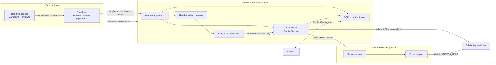
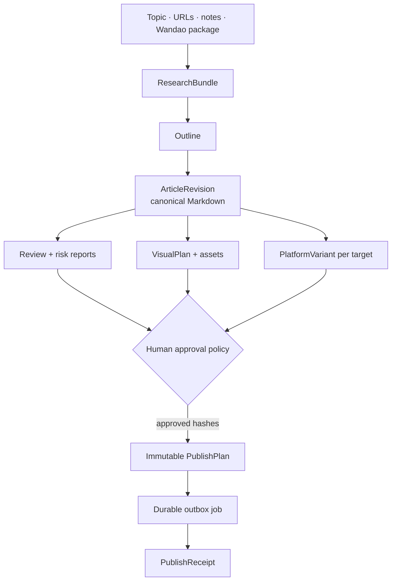

# System overview

Open Publisher is one desktop product composed of three local trust zones and an optional browser
companion. The process split is intentional: presentation, credentials, AI orchestration, and
remote publishing do not share equal authority.

## Canonical data flow

The arrows describe artifact dependencies, not permission inheritance. Producing a later artifact
does not grant an agent permission to perform a remote write.

## Deployment modes

- **v0.1 local desktop:** all orchestration and storage run on the user's machine. No hosted
  account is required.
- **optional external model gateway:** a user may configure an OpenAI-compatible endpoint. The
  gateway is not bundled and remains behind `ModelAccessLayer`.
- **future cloud runner:** scheduling and team collaboration may add a server later, but it must
  use the same versioned contracts, approval binding, and outbox semantics.
