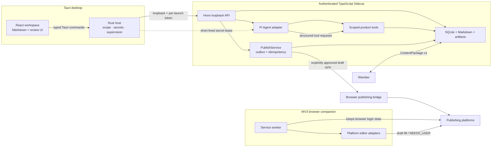
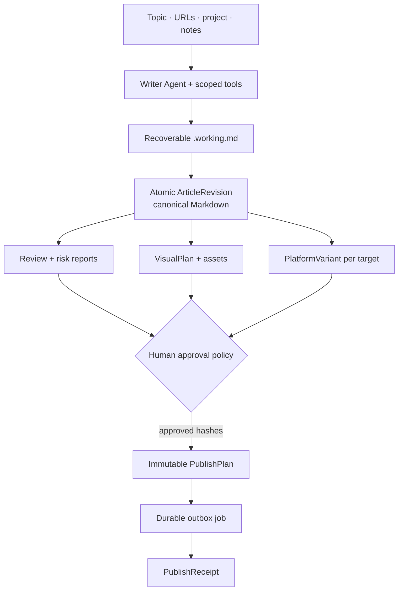

# System overview

Open Publisher is one local-first desktop product composed of three trust zones and an optional
browser companion. Presentation, operating-system authority, Agent orchestration, and remote
publishing do not share equal authority.

## Canonical data flow

The arrows describe artifact dependencies, not permission inheritance. An Agent can request a
scoped local tool, but cannot acquire secrets, arbitrary filesystem access, or publication rights.

## Deployment modes

- **Local desktop:** Rust starts a Bun-compiled TypeScript Sidecar. No hosted account is required.
- **Development and release:** Rust starts the same TypeScript/Pi Runtime entrypoint. Legacy Python
  source is migration history and is not an executable desktop path.
- **Optional model endpoint:** users may configure a supported provider or OpenAI-compatible
  endpoint. Provider capabilities are probed rather than inferred from a model name.
- **Browser draft sync:** approved jobs use the browser companion's existing login session. The
  Runtime never exports cookies and never bypasses platform verification.
- **Future Web deployment:** reuses contracts and domain interfaces, but requires new identity,
  tenant, secret, and worker implementations rather than exposing the desktop Sidecar.

ADR 0003 and `pi-agent-runtime-migration.md` are normative for the Runtime migration.
