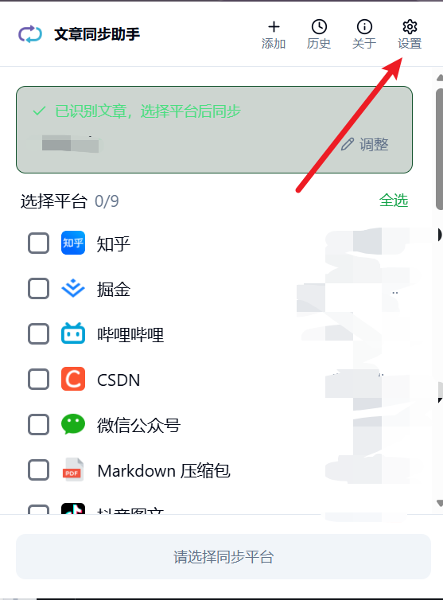
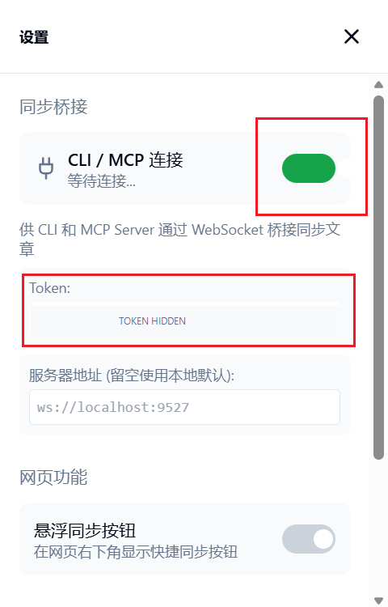

# 稿流发布使用教程

使用文章同步助手连接稿流后，可以把文章同步到微信公众号、知乎、CSDN 等平台的草稿箱。

## 1. 下载插件

打开[文章同步助手官网](https://www.wechatsync.com/?utm_source=extension_about)，下载并安装浏览器插件。

## 2. 打开插件设置

安装完成后，点击浏览器工具栏里的「文章同步助手」，再点击右上角的「设置」。

## 3. 复制连接信息

在设置中找到「同步桥接」：

1. 打开「CLI / MCP 连接」开关。
2. 复制下方显示的 `Token`。
3. 服务器地址保持为 `ws://localhost:9527`。

> 截图中的 Token 已隐藏，请复制自己插件中显示的 Token。

## 4. 填入稿流

打开稿流，进入「设置 → 平台账号 → 发布连接」，填写：

- 服务器地址：`ws://localhost:9527`
- Token：刚才从插件中复制的 Token

点击「保存并测试」。显示「已连接」后，再点击「刷新状态」，稿流就会显示浏览器中已经登录的平台。

## 5. 同步文章

1. 在稿流的「文章」页面选择文章，点击「发布」。
2. 勾选需要同步的平台。
3. 点击「同步到草稿」。
4. 打开对应平台的草稿箱，检查内容后手动完成最终发布。

如果一直显示「等待插件」，请确认插件中的「CLI / MCP 连接」开关已经打开，然后重新打开插件并在稿流中刷新状态。
