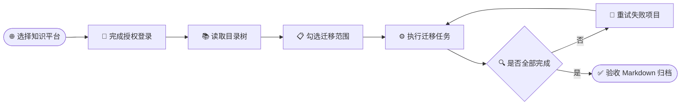

# 文档散落在十几个平台，怎么完整搬回 Markdown？试试开源工具「万能导 Wandao」

_一份面向知识库维护者、内容创作者和团队资料管理员的迁移工具体验说明_

---

> **一句话结论：** [万能导 Wandao](https://github.com/tllovesxs/wandao) 把目录读取、资源本地化、任务恢复和插件维护收进同一个桌面工作流，适合批量整理自己有权访问的知识资产。

`本地优先` · `Markdown` · `目录保留` · `图片与附件` · `失败重试` · `增量处理`

## 📋 先看结论

真正麻烦的文档迁移，往往不是把一篇文章复制出来。

你可能在飞书 Wiki 里维护团队资料，在语雀里积累个人笔记，在印象笔记或有道云里留着多年前的内容，又把新的知识整理进 Obsidian。等到需要备份、换平台，或者把整套资料交给 AI 阅读时，问题才集中冒出来：

- 目录层级怎么保留
- 正文图片放到哪里
- 附件会不会遗漏
- 处理到一半失败后是否只能重来

逐篇复制粘贴当然能做，但只适合少量内容。一旦面对完整知识库，时间通常不是花在“复制文字”上，而是耗在登录、翻目录、下载图片、整理附件、重建层级和检查遗漏这些重复动作里。

万能导针对的正是这一类批量迁移任务。它可以把用户有权访问的知识库导出为本地 Markdown，也能把本地 Markdown 导入部分受支持的平台，并尽量保留目录结构、正文格式、图片与附件。项目采用 `AGPL-3.0` 协议，当前提供 Windows x64 和 macOS Apple Silicon 安装包。[^1]

| 关键信息 | 当前情况 |
| --- | --- |
| **核心用途** | 云端知识库与本地 Markdown 之间迁移 |
| **运行方式** | 桌面端，正式版内置运行环境 |
| **任务能力** | 停止、继续、失败重试、进度、日志、报告 |
| **数据策略** | 登录凭证与任务数据保存在本机 |
| **系统支持** | Windows x64、macOS Apple Silicon |
| **项目协议** | AGPL-3.0 |

_图 1：万能导桌面端首页，平台入口、任务和设置集中在同一个工作台中_

> 📌 **边界：** 它不是一个声称“所有平台都能无损互转”的万能转换器。更准确地说，它集中处理不同平台的读取、转换和上传流程，并用任务管理、增量处理与插件机制降低批量迁移成本。

## 🔍 为什么复制粘贴不够

少量文档迁移时，手动处理的缺点不明显。打开原页面、复制正文、新建 Markdown，再把图片逐张保存下来，十几分钟也许就能结束。但当对象从“一篇文章”变成“一个知识库”，工作量会迅速变化。

### 三个最容易被低估的问题

1. **目录不是文件名列表**
   知识库往往包含知识库、文件夹、子文件夹和具体页面之间的层级。只复制正文，最后可能得到一批无法还原原始结构的文件。
2. **远程链接不等于本地备份**
   Markdown 可以保存图片和附件链接，但原平台权限变化、链接失效或账号无法访问后，只有文字还在，资源却打不开。
3. **长任务一定会遇到异常**
   批量导出可能碰到登录状态变化、安全验证、网络波动或个别页面解析失败。没有任务状态记录时，最省事的处理方式往往是全部重跑。

| 迁移方式 | 适合规模 | 目录层级 | 图片附件 | 中断恢复 | 人工核对 |
| --- | --- | --- | --- | --- | --- |
| **复制粘贴** | 少量单篇 | 手动重建 | 逐个保存 | 依赖记忆 | 高 |
| **一次性脚本** | 固定来源 | 取决于脚本 | 取决于脚本 | 常需重跑 | 中到高 |
| **万能导任务** | 批量知识库 | 按真实目录选择 | 尽量本地化 | 继续与重试 | 可通过日志定位 |

> 💡 **判断方法：** 如果资料里同时存在多层目录、正文图片、附件，或者任务需要重复执行，问题就不再是“复制速度”，而是能否记录状态和验证完整性。

## ⚙️ 它把迁移做成可恢复任务

万能导先读取平台上的真实目录树，让用户按文件夹或文档选择范围，再以任务形式执行。README 列出了停止、继续、失败重试、实时进度、日志和任务报告等能力；已经完成的内容还可以通过增量处理跳过。[^1]

### 基本操作流程

1. 在平台中心选择目标平台，以及导入或导出操作
2. 按界面提示登录，或者填写需要处理的链接
3. 读取目录，勾选需要处理的文件夹和文档
4. 启动任务，在任务中心查看进度、日志与报告
5. 任务中断或部分失败时，继续任务或重试失败项

_图 2：任务中心保留历史进度和错误信息，批量任务不必靠人工记忆完成位置_

这套流程省掉的不是某一个按钮，而是把原本分散在浏览器、文件管理器和 Markdown 编辑器之间的动作收拢起来：

- **目录选择**减少逐篇打开页面
- **资源本地化**处理正文图片和附件
- **任务记录**减少中断后的人工排查
- **增量处理**跳过已经完成的内容

_图 3：平台中心把平台能力按导入、导出和教程分类展示_

项目还提供插件中心，平台能力可以独立下载、更新和回滚。不同知识平台的页面结构、登录流程和接口行为可能变化，把适配逻辑从桌面端主体中拆出来，更便于单独维护。

_图 4：插件中心支持按需安装和更新平台能力_

> ⚠️ **迁移建议：** README 使用的是“尽量保留”正文格式、图片、附件和目录层级，而不是承诺任何来源都能百分之百无损还原。正式迁移前，应先选择一小部分代表性文档验证结果。

## 📚 平台能力要分导出和导入

“项目提到某个平台”并不代表它同时支持完整导入和导出。理解万能导的能力，最好先看操作方向，再看平台范围。

| 能力类别 | 当前定位 | 典型平台 |
| --- | --- | --- |
| **批量导出** | 云端资料沉淀为本地 Markdown | 飞书、语雀、印象笔记、有道云、WPS、Obsidian 等 |
| **批量导入** | 本地 Markdown 迁入目标知识库 | 飞书 Wiki、语雀、印象笔记、ima |
| **单篇导出** | 保存公开文章页面 | 知乎、CSDN、微信公众号 |
| **迁移教程** | 使用平台官方能力完成迁移 | Notion |

<strong>📋 展开查看导出侧的详细能力</strong>

- 语雀知识库、目录、Markdown、图片和附件导出
- 飞书 Wiki 目录、原生文档和 Markdown 文件导出
- 印象笔记按笔记本导出 Markdown、图片和附件
- 有道云笔记、为知笔记的目录与正文资源处理
- OneNote 保留笔记本、分区和页面层级，但仅适用于 Windows
- 知识星球导出项目、专栏、帖子和文章页，可选择评论和附件
- ima 知识库按知识库、文件夹或文档选择
- 钉钉文档、WPS 文档、息流的目录读取与 Markdown 导出
- Obsidian 本地 Vault 归档、资源复制与引用重写
- 知乎专栏文章与回答、CSDN 单篇博客、微信公众号单篇公开文章导出

---

### 导入侧目前更集中

| 平台 | 可用能力 |
| --- | --- |
| **飞书 Wiki** | 批量导入 Markdown，恢复多层目录 |
| **语雀** | 创建或更新知识库文档，上传图片和附件 |
| **印象笔记** | 批量导入 Markdown 及其图片、附件 |
| **ima 知识库** | 上传本地文档到知识库或已有文件夹 |

内容平台也有明确限制。例如，微信公众号当前处理单篇公开文章，可保留正文图片，但不读取历史文章与评论；知乎和 CSDN 同样以单篇公开内容导出为主。CSDN 遇到安全验证或需要登录时，可以在完成验证后继续流程。

> 📌 **不要混淆：** Notion 被放在“教程”类别。项目提供的是使用官方 Markdown 导出与迁移能力的指引，而不是自动化导入导出插件。

从体验角度看，它更适合两类方向明确的任务：

- 把云端资料沉淀为本地 Markdown，用于离线备份、长期归档或交给本地工具继续加工
- 把已经整理好的本地 Markdown 批量迁入飞书 Wiki、语雀、印象笔记或 ima，并尽可能恢复目录和资源关系

## 🔐 本地优先仍需安全边界

知识库迁移不可避免会碰到登录凭证、Cookie、账号权限和内部资料。万能导在 README 中说明，登录凭证和任务数据保存在用户电脑上，不需要把这些内容提交到公开服务。[^1]

但“本地保存”不等于可以忽略安全。项目不会破解登录，也不会绕过平台权限。用户只能处理自己有权访问的内容，并需要遵守对应平台的服务条款与版权要求。

### 使用前检查清单

- [ ] 只从项目的 GitHub Releases 获取安装包
- [ ] 不在 Issue、PR、截图或日志中公开 Cookie、密码、Token、API Key 或 App Secret
- [ ] 团队资料导出后，检查本地目录权限和备份位置
- [ ] 先用少量文档测试，再扩大处理范围
- [ ] 保持合理请求频率，避免给平台服务和账号带来风险

> ⚠️ **macOS 提醒：** 当前正式 Release 尚未完成 Developer ID 签名和 Apple 公证。应从官方 Releases 下载，在“系统设置 → 隐私与安全性”中确认来源后选择仍要打开，不建议通过清除隔离属性绕过系统校验。[^2]

性能方面，仓库没有公布统一耗时、吞吐量或大规模知识库测试数据，因此不适合给出“速度提升多少”之类的结论。能够被资料直接证明的效率设计，是增量跳过、任务恢复、失败重试和可见进度。

## 🎯 它适合谁

如果只需要搬一两篇纯文本，手动复制可能比安装新工具更直接。万能导的价值主要出现在内容数量较多、目录较深、图片附件较多，或者需要重复备份与迁移的时候。

| 更适合 | 不一定需要 |
| --- | --- |
| 团队知识库本地备份 | 一两篇纯文本复制 |
| 多平台历史资料归档 | 只保存一个网页链接 |
| 带目录、图片和附件的批量迁移 | 不关心目录与资源完整性 |
| 本地 Markdown 批量迁入知识平台 | 一次性的短内容粘贴 |
| 平台插件开发与开源共创 | 希望所有平台完全无损互转 |

### 选择前确认现实限制

- Windows 正式安装包面向 `x64`
- macOS 正式安装包面向 Apple Silicon，要求 macOS 11 或更高版本
- README 暂未列出 Linux 正式安装包和 macOS Intel 版本
- OneNote 导出仅支持 Windows
- 各平台导入与导出范围并不对称
- 页面调整、登录验证或特殊格式可能影响实际结果

对于开发者，`1.4.x` 桌面端基于 Tauri 2。源码开发需要 Python 3.10+、Node.js 22.12+、Rust 1.88.0，以及对应系统的 Tauri 前置依赖。仓库同时提供贡献指南、共创流程、插件开发与发布文档、质量检查脚本和回滚说明。[^1]

## 🚀 从这里开始

最直接的入口是 [tllovesxs/wandao GitHub 仓库](https://github.com/tllovesxs/wandao)。普通用户可以进入 [GitHub Releases](https://github.com/tllovesxs/wandao/releases)，下载对应系统的安装包。[^2]

### 第一次迁移建议

1. 挑选一个包含多层目录、正文图片和附件的样本目录
2. 从平台中心读取目录并创建小范围任务
3. 检查导出后的文件结构、Markdown 正文和本地资源
4. 在任务中心查看报告，确认没有遗漏或持续失败项
5. 验证通过后，再利用增量处理与任务恢复扩大范围

### 完成验收

- [ ] 标题和目录层级正确
- [ ] 正文图片可以离线打开
- [ ] 附件数量与来源一致
- [ ] 内部链接和资源引用没有失效
- [ ] 失败项已经重试或记录原因
- [ ] 本地备份目录权限符合资料敏感级别

如果现有插件尚未覆盖你的平台，或者某类文档无法完整导出，可以前往 [GitHub Issues](https://github.com/tllovesxs/wandao/issues) 提交可复现问题或新平台建议。涉及账号和内部资料时，务必先移除日志、截图中的敏感信息。[^3]

> **最终判断：** 万能导最值得关注的地方，不是把“平台多”当成一句口号，而是把目录读取、资源本地化、任务恢复、增量处理和插件维护放进同一套迁移流程。至于具体平台和文档能保留到什么程度，仍应通过自己的样本资料验证。

## 🔗 参考资料

[^1]: Wandao Contributors. “万能导 Wandao README.” _GitHub_. https://github.com/tllovesxs/wandao

[^2]: Wandao Contributors. “万能导 Wandao Releases.” _GitHub_. https://github.com/tllovesxs/wandao/releases

[^3]: Wandao Contributors. “万能导 Wandao Issues.” _GitHub_. https://github.com/tllovesxs/wandao/issues
